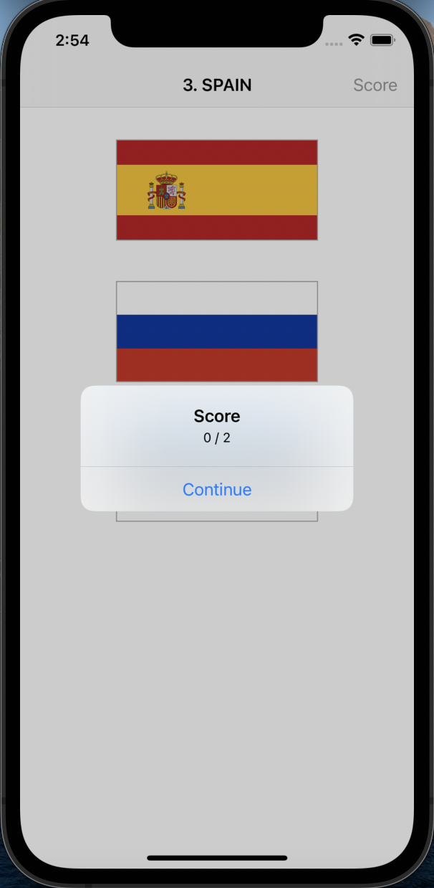
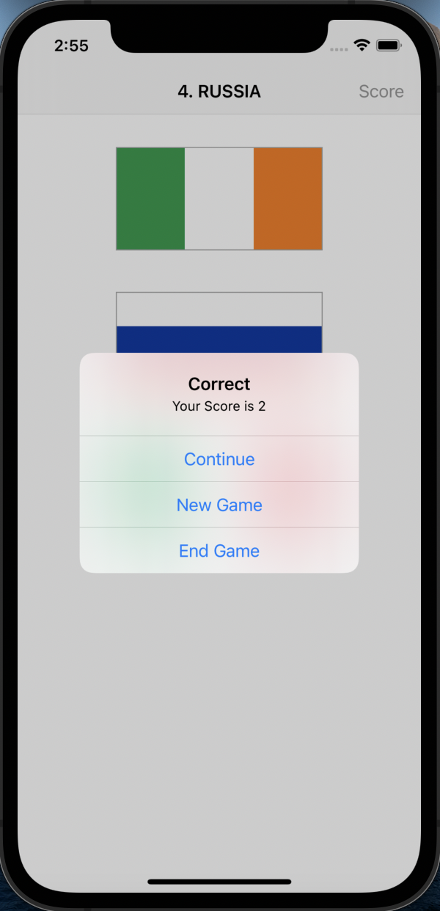
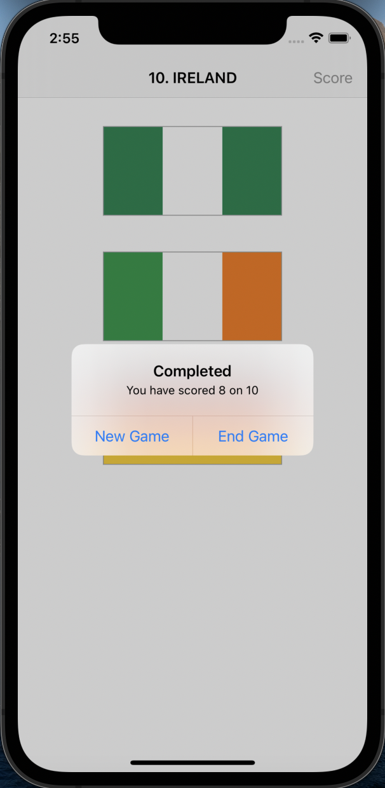

# Guess The Flag iOS App 
A simple puzzle game developed in order to understand the concepts of buttons, randomisation and alert controller, built using `Swift`, `Swift UIKit` and `XCode`. It is a simple game in which the user is asked to guess a the flag based on the name of the countries. For each correct guess, the user will be awarded a point, on the other hand a point will be deducted from the user. Thus the user plays ten rounds and the final score scored by the user will be displayed in the end.

## Tools and Languages Used :
<p>


</p>

## Download and Usage :
The code can be downloaded as a compressed `zip` file from the github web interface.

The repository can also be cloned using:
```
git clone https://github.com/BarathKumarBK-15/GuessTheFlag-iOS-App.git
```

The code of the app can be compiled using `XCode` and can be run using a simulator or an iOS device

## Components of Project :
- **Swift** files - 1
- **Storyboards** - 1
- _Note: The above mentioned files are the important additional files added to the default Xcode project files_

## About the Application :
A simple puzzle game developed in order to understand the concepts of buttons, randomisation and alert controller, built using `Swift`, `Swift UIKit` and `XCode`. It is a simple game in which the user is asked to guess a the flag based on the name of the countries. For each correct guess, the user will be awarded a point, on the other hand a point will be deducted from the user. Thus the user plays ten rounds and the final score scored by the user will be displayed in the end. The application is part of a learning program done to understand the basic of iOS development and simple concepts involved in it.
- **Game Screen** :
  - It acts as the home page of the app.
  - It provides a three buttons, each of which holds a flag of a country.
  - The user must choose a flag based on the name of the country  displayed in the navigation bar.
  - Based on the correctness of the guess, the user will either be awarded or deducted points.
  
- **Alert Dialogue Box** :
  - It carries out a lot of tasks in the game helping the progress through the game.
  - It helps to notify whether the user's guess was correct.
  - It is aldo used to display the score on clicking the `Score` button in the navigation bar.
  - Also after every round it provides the users with option to continue, start a new game or exit the game.
  
- **Graphical Features** :
  - The project contains **multiple graphical content** ranging from _bending of borders_ to _styled fonts_, _contrasting colour switches_, _pictures_ and _eye-soothing layout_.
  - The UI at the same time does not compromise on interactivity.
  - The use of swift's xcassessts make the images more responsive a variety of devices
  
- **Swift and UIKit** :
  - The `Swift` and `Swift UIKit` play the most significal role, driving the entire application.
  - The entire application is built up on various inbuilt and user defined data structures used to represent various views.
  - Various other inbuilt header files and inbuilt views are used to reach higher capabilities.
  - The application displays example of use of buttons, tags and button action.
  - It also throughs light on the usage of the alert controller which serves various purposes in the game
  
## Screenshots of the Application :
<table>
  <tr>
    <td>  </td>
    <td>  </td>
    <td>  </td>
  </tr>
  <tr>
    <td>  </td>
    <td>  </td>
    <td>  </td>
  </tr>
</table>

